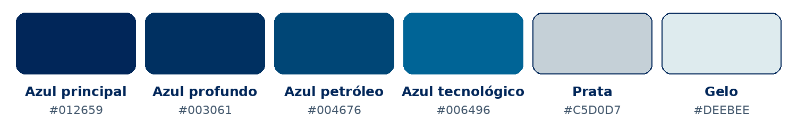

<p align="center">
  
</p>

<p align="center">
  <a href="https://github.com/solucionx/CryptoGuard/actions/workflows/ci.yml">
    
  </a>
  
  
  
  
</p>

<p align="center">
  <strong>Criptografia local de arquivos e pastas para Windows.</strong><br>
  Seus arquivos. Sua privacidade. Seu controle.
</p>

<p align="center">
  Desenvolvido pela <strong>Solucionx</strong>
</p>

---

## Visão geral

**Crypto Guard** é um aplicativo desktop para Windows criado para criptografar e descriptografar arquivos e pastas localmente. O fluxo criptográfico principal não envia arquivos nem senhas para servidores externos.

O projeto combina um frontend desktop em **Electron** com um motor criptográfico isolado em **Python**, mantendo uma fronteira pequena e explícita entre a interface e o backend.

### Principais recursos

- **AES-256-GCM** para confidencialidade e autenticação do conteúdo.
- Chave derivada da senha com **Scrypt** e salt aleatório.
- Nonce aleatório por contêiner.
- Processamento em **streaming** para arquivos grandes.
- Criptografia de **arquivos e pastas**.
- Formato atual `.cguard`, com compatibilidade legada para `.sxcrypt`.
- Validação de integridade antes da restauração.
- Senhas não são gravadas no histórico do aplicativo.
- Interface Electron isolada com `contextIsolation`, `sandbox` e `nodeIntegration: false`.
- Instalador Windows **NSIS per-user** com atualização automática segura via GitHub Releases.

> **Princípio do projeto:** a segurança do Crypto Guard não depende de esconder sua implementação. Segredos, chaves privadas, tokens e credenciais não pertencem ao código-fonte nem ao executável distribuído.

---

## Identidade visual

A interface e a documentação do Crypto Guard utilizam uma paleta derivada da própria marca, combinando azul profundo, azul tecnológico, prata e gelo.

<p align="center">
  
</p>

| Papel | Cor | Hex |
|---|---|---|
| Azul principal | Azul-marinho da marca | `#012659` |
| Azul profundo | Superfícies e contraste | `#003061` |
| Azul petróleo | Elementos secundários | `#004676` |
| Azul tecnológico | Ações e destaques | `#006496` |
| Prata | Bordas e elementos neutros | `#C5D0D7` |
| Gelo | Fundos claros e texto auxiliar | `#DEEBEE` |

---

## Segurança

O motor criptográfico utiliza **AES-256-GCM** com chave derivada por **Scrypt**, salt/nonce aleatórios, autenticação do contêiner e processamento em streaming. A senha não é armazenada e não existe chave mestra incorporada ao aplicativo.

A camada Electron foi estruturada com redução de superfície de ataque:

```text
nodeIntegration: false
contextIsolation: true
sandbox: true
webSecurity: true
```

Além disso, o processo de publicação inclui verificações de dependências, auditoria pré-publicação, CodeQL, Dependabot e workflows de CI/release.

### Documentação de segurança

| Documento | Finalidade |
|---|---|
| [`SECURITY.md`](SECURITY.md) | Como reportar vulnerabilidades de forma responsável |
| [`docs/CRYPTOGRAPHY.md`](docs/CRYPTOGRAPHY.md) | Parâmetros e formato criptográfico |
| [`docs/THREAT_MODEL.md`](docs/THREAT_MODEL.md) | Ameaças tratadas, limites e premissas |
| [`docs/ARCHITECTURE.md`](docs/ARCHITECTURE.md) | Fronteiras Electron ↔ motor criptográfico |
| [`docs/UPDATE_SECURITY.md`](docs/UPDATE_SECURITY.md) | Modelo de segurança para atualizações |

---

## Arquitetura

```text
┌──────────────────────────────┐
│      Renderer HTML/CSS/JS    │
│   sem acesso direto ao Node  │
└──────────────┬───────────────┘
               │ IPC mínimo via preload
               ▼
┌──────────────────────────────┐
│        Electron Main         │
│ diálogos, ciclo de vida, IPC │
└──────────────┬───────────────┘
               │ stdin/stdout JSON
               ▼
┌──────────────────────────────┐
│     Crypto Engine Python     │
│ AES-256-GCM + Scrypt + I/O   │
└──────────────┬───────────────┘
               │
               ▼
          arquivo .cguard
```

A interface não recebe acesso irrestrito ao sistema operacional. Operações privilegiadas passam por APIs explícitas no `preload` e pelo processo principal do Electron.

---

## Estrutura do repositório

```text
.github/       CI, CodeQL, dependency review, releases e templates
build/         recursos e metadados de build
docs/          arquitetura, criptografia e threat model
python/        motor criptográfico
scripts/       build e auditoria pré-publicação
security/      material público de verificação / placeholders
src/           Electron e interface
tests/         testes automatizados
```

---

## Desenvolvimento

### Ambiente recomendado

- Windows 10/11 x64
- Node.js `24.20.x`
- Python `3.12.x`

### Preparação

```powershell
py -3.12 -m venv .venv
.\.venv\Scripts\Activate.ps1
python -m pip install -r .\python\requirements.txt
npm ci
npm start
```

> Use `npm ci` quando o `package-lock.json` já estiver presente. Isso mantém as versões do ambiente Node alinhadas ao lockfile do projeto.

---

## Testes e auditoria

```powershell
python -m unittest discover -s tests -v
node --check .\src\main.js
node --check .\src\preload.js
node --check .\src\renderer.js
python .\scripts\public-release-audit.py
```

Antes de publicar uma release, consulte também [`PUBLICATION_READINESS.md`](PUBLICATION_READINESS.md).

---

## Build para Windows — instalador autoatualizável

```powershell
npm run build:win
```

Saída esperada:

```text
release/
├── CryptoGuard-Setup.exe
├── CryptoGuard-Setup.exe.blockmap
├── CryptoGuard-Setup.exe.sha256
└── latest.yml
```

Executáveis gerados localmente não são versionados na `main`. Releases oficiais devem ser produzidas pelo pipeline de release e acompanhadas das verificações de integridade previstas pelo projeto.

---

## Atualizações

A partir da **v1.5.1**, a build oficial usa NSIS e o aplicativo verifica a Release estável do repositório oficial ao iniciar. Quando existe versão mais nova, o download ocorre em segundo plano. A instalação só é iniciada quando não há criptografia ou descriptografia em andamento.

Controles aplicados:

- repositório de update fixado em `solucionx/CryptoGuard`;
- nenhuma credencial GitHub é embutida no aplicativo;
- pre-releases e downgrades são recusados;
- o `electron-updater` valida o metadata `latest.yml` e o hash SHA-512 do artefato;
- somente instalador NSIS completo é aceito (`nsis-web` fica desabilitado);
- falhas de rede nunca bloqueiam a abertura ou o uso do Crypto Guard;
- uma atualização baixada aguarda qualquer operação criptográfica ativa terminar antes de reiniciar o aplicativo.

> **Assinatura de código:** enquanto a Solucionx ainda não possuir um certificado Authenticode confiável, o Windows pode mostrar publisher desconhecido. A assinatura Authenticode é a próxima camada de identidade do publisher e deverá ser adicionada ao pipeline quando o certificado estiver disponível.

Detalhes em [`docs/UPDATE_SECURITY.md`](docs/UPDATE_SECURITY.md).

---

## Releases

As versões distribuíveis do Crypto Guard serão publicadas na área de **Releases** do GitHub.

<p align="center">
  <a href="https://github.com/solucionx/CryptoGuard/releases/latest">
    
  </a>
  <a href="https://github.com/solucionx/CryptoGuard/issues">
    
  </a>
  <a href="SECURITY.md">
    
  </a>
</p>

---

## Contribuições

Antes de contribuir, leia:

- [`CONTRIBUTING.md`](CONTRIBUTING.md)
- [`CODE_OF_CONDUCT.md`](CODE_OF_CONDUCT.md)
- [`SECURITY.md`](SECURITY.md)

Relatórios de vulnerabilidade não devem ser publicados em Issues abertas quando puderem colocar usuários em risco.

---

## Código-fonte, marca e direitos

O código é disponibilizado para **transparência, auditoria de segurança e colaboração controlada**. A publicação deste repositório não concede automaticamente autorização para redistribuição, venda, sublicenciamento ou uso da identidade visual do Crypto Guard/Solucionx.

Consulte [`SOURCE_AVAILABLE_NOTICE.md`](SOURCE_AVAILABLE_NOTICE.md).

**Produto:** Crypto Guard  
**Versão atual:** `1.5.2`  
**App ID:** `com.solucionx.cryptoguard`  
**Extensão:** `.cguard`  
**Compatibilidade legada:** `.sxcrypt`  
**Desenvolvido pela:** **Solucionx**

<p align="center">
  <br>
  <sub>Copyright © 2026 Solucionx. Todos os direitos reservados.</sub>
</p>


### Integração com o Explorador do Windows (v1.5.2)

Arquivos `.cguard` são registrados como arquivos protegidos do Crypto Guard. Um duplo clique abre o aplicativo diretamente na tela de descriptografia, carrega o arquivo selecionado e solicita a senha. O conteúdo nunca é restaurado automaticamente sem autenticação. Se o Crypto Guard já estiver aberto, a instância existente recebe o arquivo em vez de abrir uma segunda janela.
